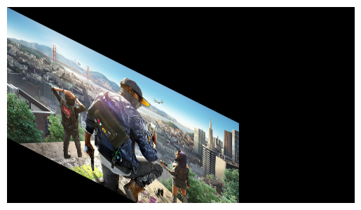

# Image-Transformation
## Aim
To perform image transformation such as Translation, Scaling, Shearing, Reflection, Rotation and Cropping using OpenCV and Python.

## Software Required:
Anaconda - Python 3.7

## Algorithm:

### Step1:

Import the necessary libraries and read the original image and save it as a image variable.
<br>

### Step2:

Translate the image.
<br>

### Step3:

Scale the image.
<br>

### Step4:

Shear the image.
<br>

### Step5:

Reflect of image.
<br>

### Step6:

Rotate the image.
<br>

## Program:
```python
Developed By: Ashwin Raaj.S
Register Number: 212221230008

i) Image Translation

import numpy as np
import cv2
import matplotlib.pyplot as plt
input_image = cv2.imread("is.jpg")
input_image = cv2.cvtColor(input_image, cv2.COLOR_BGR2RGB)
plt.axis('off')
plt.imshow(input_image)
plt.show()
rows, cols, dim = input_image.shape
M = np.float32([[1, 0, 100],
                [0, 1, 200],
                [0, 0, 1]])
translated_image = cv2.warpPerspective (input_image, M, (cols, rows))
plt.axis('off')
plt.imshow(translated_image)
plt.show()

ii) Image Scaling

S=np.float32([[4,0,0],[0,4,0],[0,0,4]])
scaled_image=cv2.warpPerspective(input_image,S,(cols*4,rows*4))
plt.axis('off')
plt.imshow(scaled_image)
plt.show()


iii) Image shearing

M_x = np.float32([[1, 0.5, 0],
                  [0, 1 ,0],
                  [0, 0 , 1]])
M_y= np.float32([[1, 0, 0],
                 [0.5, 1, 0],
                 [0, 0, 1]])
sheared_img_xaxis = cv2.warpPerspective (input_image,M_x,(int(cols*1.5), int(rows *1.5))) 
sheared_img_yaxis = cv2.warpPerspective (input_image,M_y, (int(cols*1.5), int(rows *1.5)))
plt.axis('off')
plt.imshow(sheared_img_xaxis)
plt.show()

plt.axis('off')
plt.imshow(sheared_img_yaxis)
plt.show()


iv) Image Reflection

M_x=np.float32([[1,0,0],
               [0,-1,rows],
               [0,0,1]])
M_y=np.float32([[-1,0,cols],
               [0,1,0],
               [0,0,1]])
reflected_img_xaxis=cv2.warpPerspective(input_image,M_x,(cols,rows))
reflected_img_yaxis=cv2.warpPerspective(input_image,M_y,(cols,rows))
plt.axis('off')
plt.imshow(reflected_img_xaxis)
plt.show()
plt.axis('off')
plt.imshow(reflected_img_yaxis)
plt.show()


v) Image Rotation

angle=np.radians(80)
M=np.float32([[np.sin(angle),-(np.cos(angle)),0],
               [np.cos(angle),np.sin(angle),0],
               [0,0,1]])
rotated_img=cv2.warpPerspective(input_image,M,(cols,rows))
plt.axis('off')
plt.imshow(rotated_img)
plt.show()


vi) Image Cropping

cropped_img=input_image[200:250,400:650]
plt.axis('off')
plt.imshow(cropped_img)
plt.show()


```
## Output:
### Image:

### i)Image Translation


### ii) Image Scaling


### iii)Image shearing




### iv)Image Reflection


### v)Image Rotation


### vi)Image Cropping


## Result: 

Thus the different image transformations such as Translation, Scaling, Shearing, Reflection, Rotation and Cropping are done using OpenCV and python programming.V